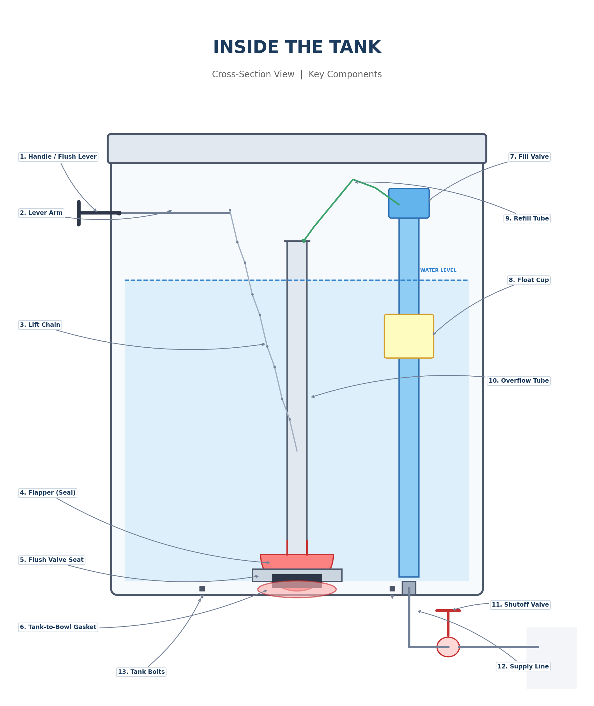
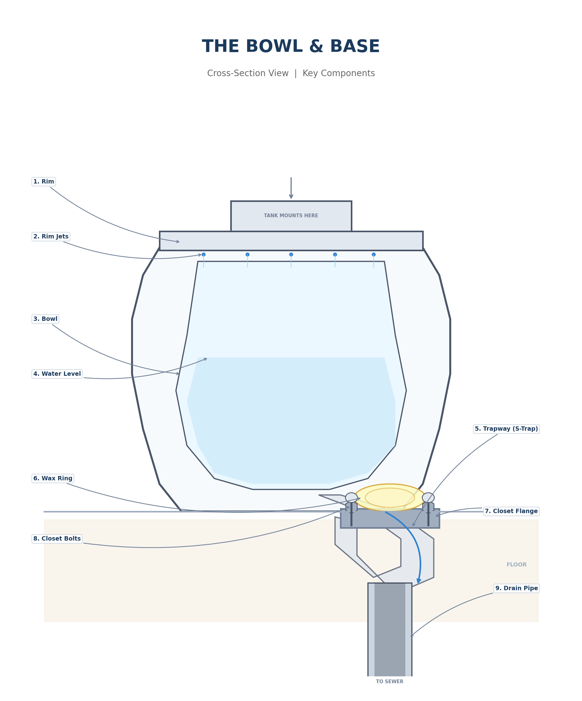

# 🔧 Toilet Troubleshooting & Repair

**A Complete Reference for Diagnosing and Fixing Common Toilet Problems**

---

## 🛠️ Before You Start

### Tools You'll Need

- Adjustable wrench
- Tongue-and-groove pliers (Channel Locks)
- Flathead and Phillips screwdrivers
- Bucket and old towels
- Sponge
- Flashlight
- Small mirror (for inspecting under the rim)
- Replacement parts as needed

### Safety First

1. **Turn off the water supply valve** — located behind the toilet, near the floor. Turn it **clockwise** to shut off.
2. **Flush the toilet** to empty the tank. Hold the handle down to drain as much water as possible.
3. **Sponge out remaining water** in the tank if you need to remove parts.
4. Have towels and a bucket ready to catch residual water.

> [!TIP]
> Take photos of the inside of your tank before removing anything — it makes reassembly much easier.

---

## Know Your Toilet — Key Components

### Diagram A: Inside the Tank

### Diagram B: The Bowl & Base

---

### Inside the Tank — Component Reference

| Component | What It Does |
|---|---|
| **Fill Valve** | Tall vertical assembly (usually on the left). Refills the tank after a flush. Connected to the water supply line below. |
| **Float / Float Cup** | Attached to the fill valve. Rises with the water level and signals the fill valve to shut off when the tank is full. |
| **Overflow Tube** | Tall open tube in the center of the tank. Prevents overfilling by draining excess water into the bowl. |
| **Flapper** | Rubber disc at the bottom of the overflow tube. Lifts when you flush to let water rush into the bowl, then seals the flush valve seat. |
| **Flush Valve Seat** | The opening at the bottom center of the tank where water exits into the bowl. The flapper sits on top of it. |
| **Chain (Lift Chain)** | Connects the flush lever arm to the flapper. Pulls the flapper up when you push the handle. |
| **Handle / Flush Lever** | The exterior handle and interior lever arm that lifts the chain and flapper. |
| **Refill Tube** | Small flexible tube from the fill valve clipped to the top of the overflow tube. Directs a small stream of water into the bowl during refill. |
| **Tank-to-Bowl Bolts** | Bolts at the bottom of the tank that secure the tank to the bowl. Have rubber washers for sealing. |
| **Tank-to-Bowl Gasket** | Large rubber gasket (spud washer) between the tank and bowl that prevents leaks. |
| **Water Supply Line** | Flexible braided line from the shutoff valve to the fill valve at the bottom of the tank. |
| **Shutoff Valve** | Wall-mounted valve below and behind the toilet. Controls water flow to the toilet. |

### The Bowl & Base

| Component | What It Does |
|---|---|
| **Bowl** | The porcelain fixture that holds water and waste. |
| **Rim Jets / Rim Holes** | Small holes under the rim where water enters during a flush, creating the swirling action. |
| **Trapway (Internal Trap)** | The S-shaped passage inside the bowl. Creates the siphon that pulls waste through during a flush. |
| **Wax Ring** | A wax (or wax-free rubber) gasket between the toilet base and the closet flange. Seals the connection to prevent leaks and sewer gas. |
| **Closet Flange** | The metal or PVC ring bolted to the floor, connected to the drain pipe. The toilet bolts onto it. |
| **Closet Bolts (Johnny Bolts)** | Two bolts that extend up from the closet flange through the base of the toilet, holding it to the floor. |
| **Drain Pipe** | The pipe below the closet flange that carries waste to your home's drain system. |

---

## 🔍 Quick Diagnosis Table

| Symptom | Most Likely Cause | Go To Section |
|---|---|---|
| Toilet keeps running | Worn flapper, high water level, or faulty fill valve | [Problem 1](#problem-1-toilet-keeps-running) |
| Weak or incomplete flush | Low water level, clogged rim jets, or flapper closing too fast | [Problem 2](#problem-2-weak-or-incomplete-flush) |
| Toilet won't flush at all | Broken/disconnected chain or handle | [Problem 3](#problem-3-toilet-wont-flush-at-all) |
| Water leaking at base | Failed wax ring or loose closet bolts | [Problem 4](#problem-4-water-leaking-at-the-base) |
| Water leaking between tank and bowl | Worn tank-to-bowl gasket or loose tank bolts | [Problem 5](#problem-5-water-leaking-between-tank-and-bowl) |
| Phantom flushing (random refills) | Slow leak past the flapper | [Problem 6](#problem-6-phantom-flushing-random-refills) |
| Slow tank refill | Partially closed shutoff valve or clogged fill valve | [Problem 7](#problem-7-slow-tank-refill) |
| Toilet rocks or wobbles | Loose closet bolts or uneven floor | [Problem 8](#problem-8-toilet-rocks-or-wobbles) |

---

## Problem 1: Toilet Keeps Running

**Cost Estimate:** $5–$15 · **Difficulty:** ● ○ ○ Easy

### Symptoms

- You hear water constantly running or trickling.
- The tank never seems to stop filling.
- Your water bill is higher than usual.

### Common Causes

- Worn, warped, or mineral-encrusted flapper
- Flapper chain is too tight, tangled, or too short
- Fill valve is not shutting off properly
- Water level is set too high (above the overflow tube)

### Diagnostic Steps

1. Remove the tank lid and observe the water.
2. **Is water flowing into the overflow tube?** → The water level is set too high.
3. **Push down on the flapper with your finger.** If the running stops, the flapper isn't sealing properly and needs replacement.
4. **Check the chain.** Is it tangled, kinked, or too short (pulling the flapper open)?

### The Fix

- **If the flapper is the problem:** Turn off the water, flush to drain the tank, unhook the old flapper from the overflow tube pegs, and hook on a new universal flapper ($5–$8).
- **If the water level is too high:** Adjust the float on the fill valve to lower the water level. The water should sit about **1 inch below the top of the overflow tube**. On a float-cup fill valve, squeeze the clip and slide the float down. On a ball-float, bend the rod slightly downward.
- **If the fill valve is old or failing:** Replace the entire fill valve assembly ($8–$15). They're universal and come with instructions.

> [!TIP]
> Bring your old flapper to the hardware store to match the size. Most toilets made after 2005 use a **2-inch flapper**, but some high-efficiency models use a **3-inch**.

---

## Problem 2: Weak or Incomplete Flush

**Cost Estimate:** $0–$10 · **Difficulty:** ● ○ ○ Easy

### Symptoms

- Bowl doesn't clear fully.
- Water swirls but doesn't push waste through.
- You have to flush twice.

### Common Causes

- Low water level in the tank
- Clogged rim jets (mineral buildup)
- Partially blocked trapway
- Flapper is closing too soon (chain too short)

### Diagnostic Steps

1. **Check the tank water level.** It should be at the marked fill line or about 1 inch below the overflow tube.
2. **Use a small mirror** to look under the rim — are the rim holes clogged with mineral buildup?
3. **Watch the flapper during a flush.** Does it drop back down too quickly? The chain may be too short, not allowing a full flush cycle.

### The Fix

- **Low water level:** Adjust the fill valve float upward to raise the water level.
- **Clogged rim jets:** Use a small piece of wire, an Allen wrench, or a thin nail to carefully clear each hole under the rim. Then pour **white vinegar** under the rim (use a funnel or squeeze bottle) and let it sit overnight. Scrub and flush in the morning.
- **Flapper closing too fast:** Adjust the chain so there's about **½ inch of slack** when the flapper is closed.

> [!TIP]
> In hard-water areas, clean the rim jets every 6 months with vinegar to maintain full flush power.

---

## Problem 3: Toilet Won't Flush at All

**Cost Estimate:** $5–$12 · **Difficulty:** ● ○ ○ Easy

### Symptoms

- Handle feels loose, floppy, or disconnected.
- Pushing the handle does absolutely nothing.

### Common Causes

- Broken or disconnected lift chain
- Broken flush handle or lever arm
- Broken or corroded flush lever mounting nut

### Diagnostic Steps

1. Remove the tank lid.
2. **Push the handle** — does the lever arm move inside the tank? If not, the handle mechanism is broken.
3. **Check the chain.** Is it connected to both the lever arm and the flapper? It may have slipped off.

### The Fix

- **Chain is disconnected:** Reattach the chain clip to the lever arm hole and/or the flapper ears.
- **Handle is broken:** Replace the handle assembly. Unscrew the mounting nut **inside** the tank.

> [!IMPORTANT]
> The mounting nut on a toilet handle has **REVERSE THREADS** — turn **clockwise** to loosen, **counter-clockwise** to tighten. This is the #1 thing that trips up DIYers. Remember: **"righty loosey"** for toilet handles!

---

## Problem 4: Water Leaking at the Base

**Cost Estimate:** $5–$15 (wax ring) · **Difficulty:** ● ● ○ Moderate

### Symptoms

- Water pooling around the base of the toilet on the floor.
- Possible sewer odor near the base.
- Staining or water damage on the floor around the toilet.

### Common Causes

- Failed wax ring (most common)
- Loose closet bolts
- Cracked toilet base (inspect carefully)
- Condensation on the bowl (rule this out first!)

### Diagnostic Steps

1. **Rule out condensation first** — wipe the bowl completely dry, lay paper towels around the base, and wait a few hours. If it's only happening during humid weather, it's likely condensation, not a leak.
2. **Try tightening the closet bolts** (the bolts at the base, under decorative plastic caps). Tighten gently and evenly — **do not overtighten**, as you can crack the porcelain!
3. If water still appears, especially during or after a flush, **the wax ring needs replacement**.

### The Fix — Wax Ring Replacement

1. Turn off the water supply and flush the toilet. Sponge out all remaining water from the tank and bowl.
2. Disconnect the water supply line from the fill valve.
3. Remove the decorative caps and unscrew the closet bolts (one on each side of the base).
4. **Lift the toilet straight up** off the bolts and set it on its side on old towels or cardboard. (Toilets weigh 60–80 lbs — a helper is recommended.)
5. Scrape off the old wax ring from **both** the closet flange and the bottom of the toilet (use a putty knife, wear gloves).
6. Stuff a rag into the open drain pipe to block sewer gas while you work.
7. Press the new wax ring onto the closet flange (flat side down, tapered side up), or onto the toilet's horn (outlet).
8. Remove the rag from the drain. Carefully lower the toilet **straight down** onto the closet bolts. Press down firmly with a slight rocking motion to seat the wax ring.
9. Hand-tighten the closet bolts, then snug them with a wrench — **alternating sides** and going slowly to avoid cracking porcelain.
10. Reconnect the supply line, turn on the water, flush, and check for leaks.

> [!TIP]
> Consider a **wax-free rubber gasket** (like Fluidmaster's Better Than Wax). They're reusable, less messy, and make future toilet removal much easier.

---

## Problem 5: Water Leaking Between Tank and Bowl

**Cost Estimate:** $5–$10 · **Difficulty:** ● ● ○ Moderate

### Symptoms

- Water dripping at the seam where the tank sits on the bowl.
- Damp or water pooling behind the toilet bowl.

### Common Causes

- Loose tank-to-bowl bolts
- Worn tank-to-bowl gasket (spud washer)
- Cracked tank (inspect carefully)

### Diagnostic Steps

1. Dry the area thoroughly and identify exactly where the drips originate.
2. **Check the tank bolts** — gently tighten them (finger-tight plus a quarter turn with a wrench). Alternate sides for even pressure.
3. If the bolts are snug and it still leaks, the **tank-to-bowl gasket** is worn out.

### The Fix — Gasket Replacement

1. Turn off the water, flush, and sponge out all remaining water.
2. Disconnect the water supply line.
3. Remove the tank bolts from inside the tank (hold the nut below with pliers while turning the bolt above with a screwdriver).
4. Lift the tank straight up off the bowl.
5. Remove the old gasket and replace it with a new one.
6. Replace the bolt washers as well.
7. Set the tank back on the bowl, reinsert bolts, and tighten evenly.
8. Reconnect supply line, turn on water, and check for leaks.

> [!TIP]
> Replace the tank bolts and rubber washers at the same time as the gasket — they're cheap and usually sold together in a kit.

---

## Problem 6: Phantom Flushing (Random Refills)

**Cost Estimate:** $5–$8 · **Difficulty:** ● ○ ○ Easy

### Symptoms

- The toilet randomly starts refilling on its own every few minutes.
- No one has flushed, but you hear the tank filling.

### Common Causes

- Slow leak past the flapper (most common by far)
- Hairline crack in the overflow tube (rare)

### Diagnostic Steps

1. **The Food Coloring Test:** Put 5–10 drops of food coloring (or a dye tablet) into the tank water. **Do NOT flush.** Wait 15–30 minutes.
2. Check the bowl water. **If the color has appeared in the bowl, the flapper is leaking.**

### The Fix

- Replace the flapper (same procedure as Problem 1).
- If the flapper seat (the rim the flapper sits on) is rough, pitted, or has mineral buildup, clean it with **fine steel wool** or an emery cloth before installing the new flapper.
- If the seat is badly damaged, the entire flush valve may need replacement.

> [!TIP]
> The food coloring test is the single most useful diagnostic trick in toilet repair. Try it first whenever you suspect a leak!

---

## Problem 7: Slow Tank Refill

**Cost Estimate:** $0–$15 · **Difficulty:** ● ○ ○ Easy to Moderate

### Symptoms

- Tank takes a very long time to refill after flushing (more than 2–3 minutes).
- Weak stream of water entering the tank.

### Common Causes

- Shutoff valve not fully open
- Clogged or sediment-blocked fill valve
- Kinked or deteriorating water supply line
- Low household water pressure

### Diagnostic Steps

1. **Check the shutoff valve** — make sure it's fully open (turn counter-clockwise until it stops).
2. **Inspect the supply line** for kinks, tight bends, or swelling.
3. If those are fine, the fill valve likely has **debris or sediment** clogging it.

### The Fix

- **Shutoff valve:** Turn it fully counter-clockwise to open.
- **Kinked supply line:** Replace the supply line ($5–$8).
- **Clogged fill valve — flush it out:**
    1. Turn off the water supply.
    2. Remove the fill valve cap (twist or unclip it off the top).
    3. Place an upside-down cup over the uncapped valve opening (to contain the spray).
    4. Briefly turn the water back on for 10–15 seconds. The pressure will flush out debris.
    5. Turn off the water, replace the cap, turn water back on.
- **Old fill valve:** If the valve is old or still doesn't work well after flushing, replace the entire unit ($8–$15).

> [!TIP]
> If your home has hard water, fill valves may need cleaning or full replacement every **5–7 years**.

---

## Problem 8: Toilet Rocks or Wobbles

**Cost Estimate:** $2–$15 · **Difficulty:** ● ○ ○ Easy to Moderate

### Symptoms

- Toilet shifts or rocks when you sit on it.
- Movement may eventually break the wax seal and cause a leak (Problem 4).

### Common Causes

- Loose closet bolts
- Uneven floor
- Broken or corroded closet flange

### Diagnostic Steps

1. **Try tightening the closet bolts** (under the decorative caps at the base). Tighten gently and evenly.
2. **Check if the floor is uneven** by placing a level across the top of the bowl.
3. If bolts are tight and it still rocks, the **closet flange** may be broken or sitting below the floor level.

### The Fix

- **Loose bolts:** Tighten evenly. If they just spin (flange slots are worn), you may need to replace them using a flange bolt repair kit.
- **Uneven floor:** Use **plastic toilet shims** (available at any hardware store). Slide them under the base until the toilet is stable, then trim the shims flush with a utility knife.
- **Broken flange:** A **flange repair ring** (metal plate that bolts on top of the old flange) can fix it without replacing the entire flange.

After shimming or stabilizing:

- **Caulk around the base** with silicone caulk for a finished look and code compliance. Leave a **small gap at the back** (about 1 inch) so you can spot any future leaks early.

> [!TIP]
> Most plumbing codes require caulking around the toilet base. It also prevents water from mopping from seeping underneath and causing odor.

---

## When to Call a Plumber

Not every toilet problem is a DIY job. **Call a licensed plumber if you encounter:**

- **Persistent sewer gas smell** that doesn't go away after wax ring replacement
- **Water stains on the ceiling** below a second-floor bathroom (indicates an active leak into your structure)
- **Cracked porcelain** on the bowl or tank — these cannot be reliably repaired and the fixture must be replaced
- **Broken or corroded closet flange** that requires cutting into the drain pipe
- **Recurring clogs** that a plunger or toilet auger can't fix — this may indicate a **main sewer line issue**
- **Any repair you're not comfortable doing yourself** — there's no shame in calling a pro!

---

## Preventive Maintenance Checklist

### Every 6 Months

- [ ] Inspect the flapper for warping, cracks, or mineral buildup
- [ ] Clean rim jets with vinegar and a thin wire
- [ ] Check the water supply line for cracks, bulges, or leaks
- [ ] Run the food coloring test for silent leaks

### Annually

- [ ] Operate the shutoff valve (turn it off and back on) to prevent it from seizing
- [ ] Inspect all tank components for wear
- [ ] Check caulk around the base — recaulk if cracked or peeling
- [ ] Tighten tank bolts and closet bolts if needed

### Every 5 Years

- [ ] Consider proactively replacing the flapper, fill valve, and supply line
- [ ] Replace the wax ring if you remove the toilet for any reason (never reuse a wax ring)

### Never Do This

- ❌ **Never use drop-in bleach tablets** — they degrade rubber parts (flappers, gaskets, seals) rapidly, causing leaks within months. Use **white vinegar** for cleaning instead.
- ❌ **Never overtighten bolts on porcelain** — it cracks easily and a cracked toilet must be fully replaced.
- ❌ **Never ignore a small leak** — water damage is cumulative and expensive.

---

## 📎 Quick Reference: Common Replacement Parts

| Part | Typical Cost | Lifespan | Notes |
|---|---|---|---|
| Flapper | $5–$8 | 3–5 years | Match size (2" or 3"). Bring old one to the store. |
| Fill Valve | $8–$15 | 5–7 years | Universal fit. Fluidmaster 400A is the most popular. |
| Wax Ring | $3–$6 | Life of the install | Replace every time you remove the toilet. |
| Wax-Free Gasket | $8–$15 | Life of the install | Reusable. Easier for future removal. |
| Supply Line | $5–$10 | 5–10 years | Use braided stainless steel for durability. |
| Handle/Lever | $5–$12 | 10+ years | Remember: reverse threads! |
| Tank-to-Bowl Kit | $5–$10 | 10+ years | Includes gasket, bolts, and washers. |
| Toilet Shims | $2–$4 | Permanent | Plastic. Trim flush and caulk over them. |

---

*Keep this guide near your toolbox. Most toilet repairs cost **$5–$20** in parts and take **under 30 minutes**. A little DIY knowledge saves hundreds in plumber service calls.*
